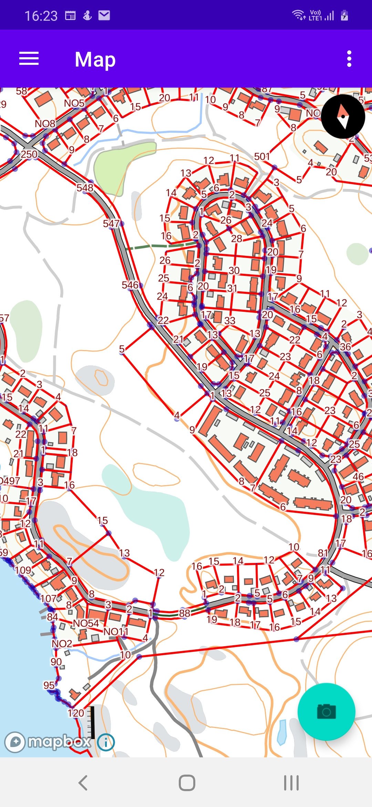

# beta-karttakuva-maplibre-gl-native

Unofficial Proof-of-concept Android app for <https://avoin-karttakuva.maanmittauslaitos.fi> Vector tiles service.
see <https://beta-karttakuva.maanmittauslaitos.fi> for more information.
No support or warranty of any kind is available. 

This is a fresh copy-paste-modify Android MapApp based on Maplibre GL JS fork.

This version requires Android 10 

